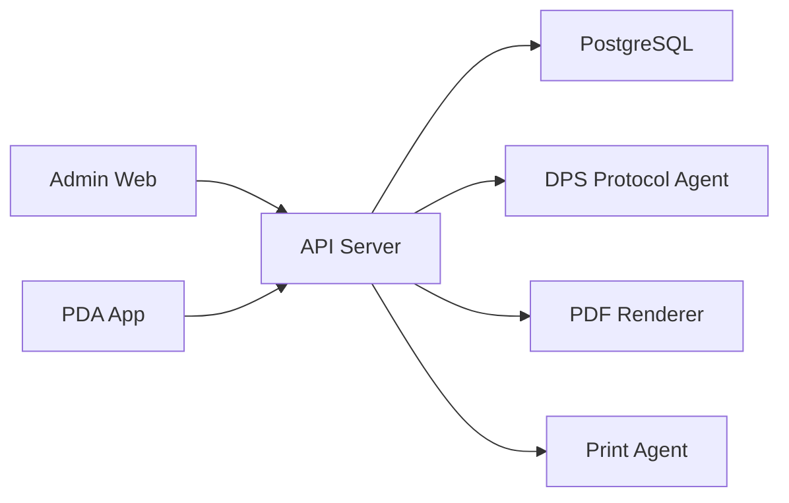
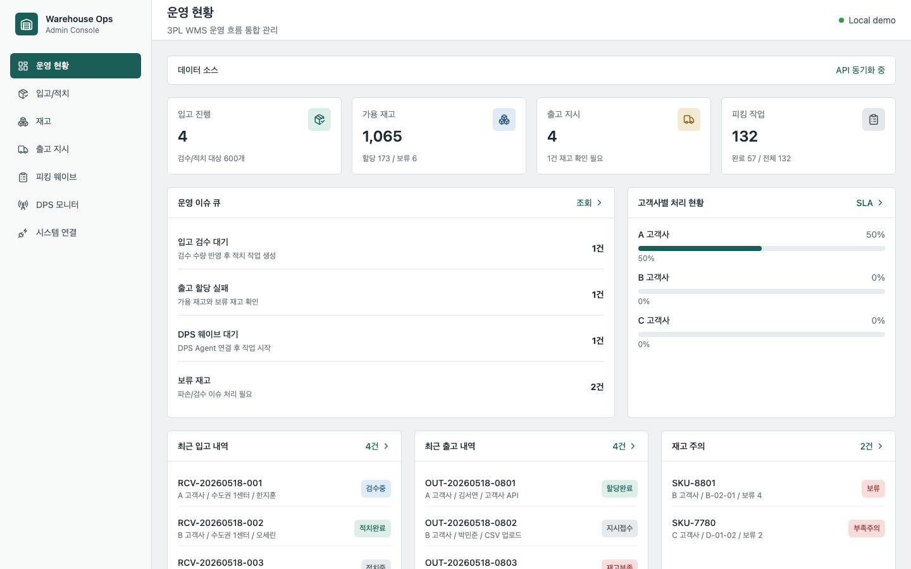
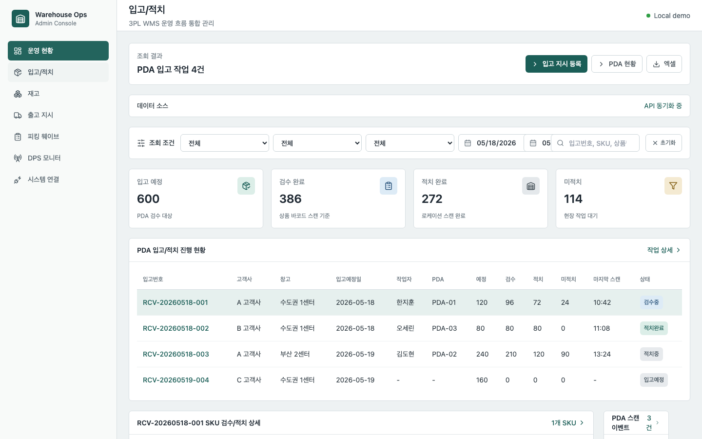
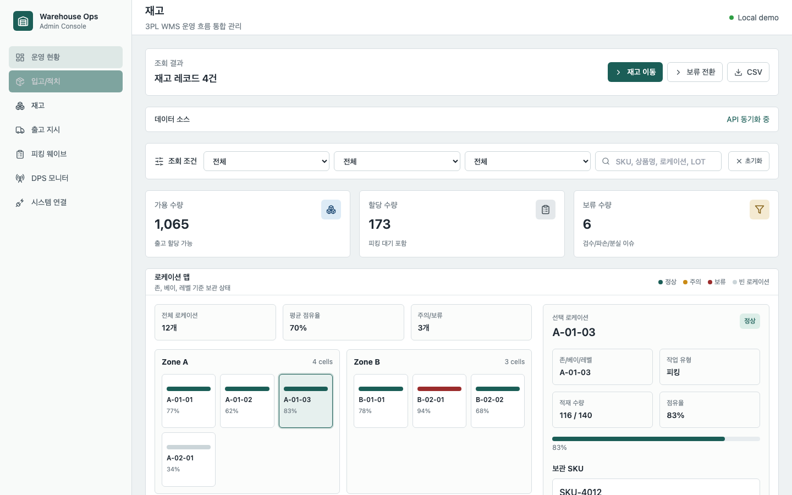
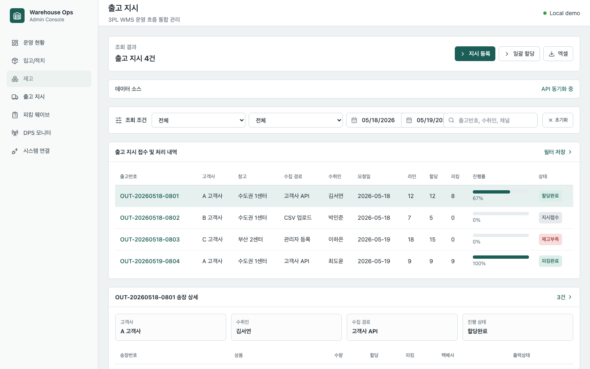
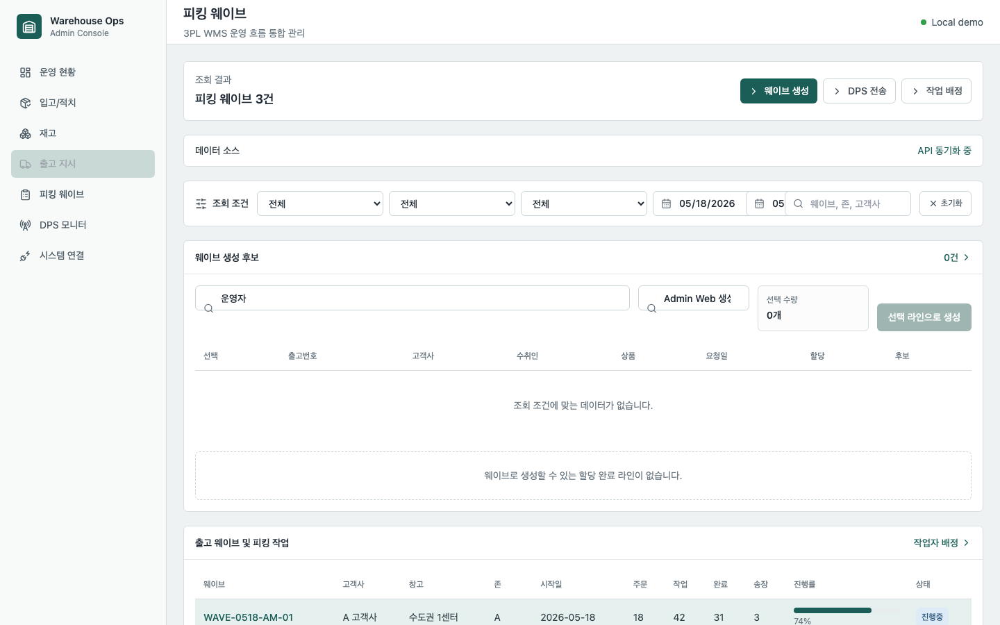
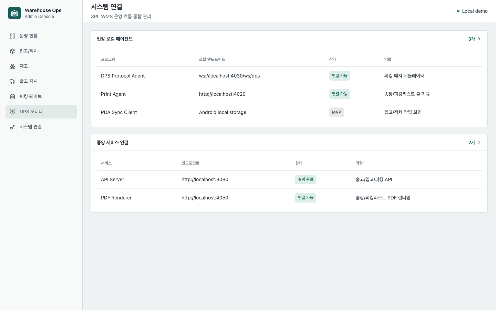

# Warehouse Ops Suite

3PL 물류센터는 여러 고객사의 상품을 대신 보관하고, 주문이 들어오면 재고 확인, 피킹, 패킹, 출고까지 수행합니다. 이 프로젝트는 그 흐름을 하나의 운영 시스템으로 재구성한 WMS 포트폴리오입니다.

회사 코드, 내부 API, 실제 고객사 데이터는 사용하지 않았습니다. 실무에서 다뤘던 물류 운영 문제를 일반화해 도메인 모델, API, 관리자 화면, 현장 에이전트 구조를 새로 설계했습니다.

## 문제 정의

### 단순 CRUD로는 설명하기 어려운 작업 상태

단순 재고 CRUD만으로는 물류센터 운영을 설명하기 어렵습니다. 실제 현장에서는 입고 예정 수량과 검수 수량이 다르고, 검수된 상품은 여러 로케이션에 나뉘어 적치됩니다. 출고 역시 주문 번호 하나만으로 끝나지 않고, 고객사별 출고 지시, 재고 할당, 피킹 웨이브, DPS 장비, 출력 큐까지 이어집니다.

### 목표

그래서 이 프로젝트의 목표는 기능 목록을 많이 만드는 것이 아니라, WMS가 다루는 상태와 작업 단위를 화면과 API 구조로 드러내는 것이었습니다.

## 시스템 구성

### 실행 단위

Warehouse Ops Suite는 하나의 레포 안에 6개의 실행 단위를 둔 멀티 애플리케이션 구조입니다.

| 실행 단위 | 역할 |
| --- | --- |
| Admin Web | 운영자가 입고, 재고, 출고, 피킹, 에이전트 상태를 보는 관리자 화면 |
| API Server | WMS 핵심 도메인 API와 상태 전이 처리 |
| PDA App | 입고 검수, 로케이션 적치, 피킹 작업을 수행하는 현장 앱 |
| DPS Protocol Agent | DPS 장비 프로토콜을 WebSocket으로 시뮬레이션 |
| Print Agent | 로컬 PC에서 프린터 목록과 출력 큐를 관리 |
| PDF Renderer | 송장, 피킹리스트 같은 출력 문서를 생성 |

### 중앙 서비스와 현장 에이전트 분리

중앙 서비스와 현장 실행 단위를 분리한 이유는 배포 위치와 장애 대응 방식이 다르기 때문입니다. API Server와 PDF Renderer는 중앙 서비스로 둘 수 있지만, 프린터나 DPS 같은 현장 장비 연동은 로컬 네트워크와 장비 상태에 크게 의존합니다.



## 운영 현황

### 운영자가 먼저 봐야 하는 정보

운영 현황 화면은 입고, 재고, 출고, 피킹 상태를 한 화면에서 확인하도록 만들었습니다. 단순 KPI 카드만 두지 않고, 운영 이슈 큐와 고객사별 처리 현황을 함께 배치했습니다.



### 이슈 큐 중심의 화면 구성

이 화면에서 중요하게 본 지점은 "오늘 무엇을 먼저 처리해야 하는가"입니다. 입고 검수 대기, 출고 할당 실패, DPS 웨이브 대기, 보류 재고처럼 운영자가 바로 움직여야 하는 항목을 별도 큐로 분리했습니다.

## 입고와 적치

### 예정 수량과 검수 수량 분리

입고는 예정 수량을 등록하는 것만으로 끝나지 않습니다. 실제 현장에서는 PDA로 상품을 검수하고, 검수된 수량을 로케이션에 나누어 적치합니다. 그래서 입고 상세는 예정 수량, 검수 수량, 적치 수량을 분리해서 모델링했습니다.



### 도메인 모델

핵심 모델은 다음과 같습니다.

| 모델 | 설명 |
| --- | --- |
| ReceivingOrder | 입고 지시 헤더 |
| ReceivingOrderLine | SKU별 입고 예정/검수 수량 |
| PutawayTask | 특정 입고 상세 수량을 특정 로케이션으로 적치하는 작업 |
| Inventory | 적치 완료 후 증가하는 고객사별 재고 |

하나의 입고 상세에 여러 적치 작업이 연결될 수 있게 하여, "100개 입고 -> A 로케이션 40개, B 로케이션 60개 적치" 같은 흐름을 표현했습니다.

## 재고와 로케이션

### 고객사 소유 재고

3PL에서는 재고의 물리적 위치뿐 아니라 소유 고객사도 중요합니다. 같은 SKU처럼 보여도 고객사가 다르면 별도의 재고로 봐야 하고, 가용 수량과 할당 수량도 분리되어야 합니다.



### 로케이션 가시화

재고 화면은 고객사, 창고, 로케이션, SKU를 기준으로 운영자가 재고를 좁혀볼 수 있게 구성했습니다. 로케이션 현황은 적재율과 상태를 함께 보여주어, 특정 구역에 재고가 몰리거나 보류 재고가 쌓이는 상황을 빠르게 파악할 수 있게 했습니다.

## 출고 지시 접수

### WMS가 받는 입력

이 프로젝트에서 WMS는 주문 수집 시스템이 아니라 출고 지시를 받는 시스템으로 정의했습니다. 고객사 OMS, 쇼핑몰, ERP, CSV 업로드, 관리자 수기 등록 등 다양한 경로에서 출고 지시가 들어올 수 있고, WMS는 이를 검증한 뒤 재고 할당과 피킹으로 연결합니다.



### 접수 시 검증

출고 지시 접수에서 중요한 검증은 세 가지입니다.

- 고객사, 창고, SKU가 실제 존재하는지 확인
- 같은 고객사의 출고 지시 번호가 중복되지 않는지 확인
- 출고 라인별 요청 수량이 재고 할당 가능한 상태인지 확인

출고 지시는 헤더와 라인을 분리했고, 라인에는 요청 수량, 할당 수량, 피킹 수량을 따로 둬서 작업 진행 상태를 추적할 수 있게 했습니다.

## 피킹 웨이브

### 출고 지시를 현장 작업으로 묶기

피킹 웨이브는 여러 출고 지시 라인을 현장 작업 단위로 묶는 과정입니다. 운영자는 웨이브를 선택해 하위 송장과 상품 라인을 확인하고, DPS 전송이나 피킹리스트 출력 같은 현장 액션을 실행할 수 있습니다.



### 웨이브 생성 흐름

웨이브 생성 흐름은 다음과 같이 잡았습니다.

```text
출고 지시 접수
-> 재고 할당
-> 출고 지시 라인 선택
-> PickingWave 생성
-> PickingTask 생성
-> DPS 전송 또는 PDA 피킹
```

이 구조를 통해 관리자 화면에서는 웨이브 단위의 진행 상태를 보고, PDA나 DPS 에이전트는 실제 작업 단위인 PickingTask를 처리할 수 있습니다.

## DPS Protocol Agent

### 실제 장비를 대체하는 시뮬레이터

DPS는 피킹 위치의 셀을 점등해 작업자가 어떤 상품을 집어야 하는지 안내하는 장비입니다. 실제 하드웨어를 포트폴리오에서 사용할 수 없기 때문에, WebSocket 기반 프로토콜 에이전트로 장비 이벤트를 시뮬레이션했습니다.


### WebSocket 이벤트 흐름

Admin Web은 DPS Agent의 연결 상태와 셀별 작업 상태를 확인합니다. API Server는 피킹 웨이브를 DPS 배치 메시지로 변환하고, DPS Agent는 점등, 완료, 실패 이벤트를 다시 브로드캐스트합니다.

## 시스템 연결과 배포 단위

### 하나의 레포, 여러 실행 위치

이 프로젝트는 모노레포지만 하나의 애플리케이션은 아닙니다. 실행 위치와 릴리즈 주기가 다른 프로그램들이 함께 있습니다. 그래서 시스템 연결 화면에서는 중앙 서비스와 로컬 에이전트를 분리해서 보여주도록 했습니다.



### 배포 기준

배포 관점에서는 다음 기준을 두었습니다.

| 구분 | 예시 | 배포 특성 |
| --- | --- | --- |
| 중앙 서비스 | API Server, PDF Renderer | 서버 인프라에 배포 |
| 웹 클라이언트 | Admin Web | 정적 빌드 또는 CDN 배포 |
| 현장 앱 | PDA App | Android 기기 배포 |
| 로컬 에이전트 | Print Agent, DPS Agent | 센터 PC 또는 현장 네트워크에 설치 |

## 포트폴리오 패키지 배포

### 허브와 연결되는 blog 패키지

이 프로젝트는 포트폴리오 허브와 연동하기 위해 `blog/` 패키지를 별도로 둡니다. 프로젝트 레포의 `blog/article.md`와 `blog/images/`를 GitHub Actions에서 패키징하고, 이후 S3의 `portfolio-feed/warehouse-ops-suite/` 경로로 업로드할 수 있게 구성했습니다.

```text
blog/article.md
blog/images/*
.portfolio/manifest.json
-> dist/portfolio-package/
-> S3 portfolio-feed
-> Portfolio Hub
```

현재는 AWS Secrets가 없으면 S3 업로드를 건너뛰고 패키지 artifact만 생성합니다. Secrets를 추가하면 main 브랜치 push 시 같은 워크플로우가 S3 업로드까지 수행합니다.

## 구현 범위

### 현재 완료 범위

| 영역 | 구현 상태 |
| --- | --- |
| 고객사별 재고 모델 | 완료 |
| 입고/검수/분할 적치 | 완료 |
| 출고 지시 접수/조회 | 완료 |
| 재고 할당 | 완료 |
| 피킹 웨이브 | 완료 |
| DPS WebSocket 연동 | 완료 |
| PDF Renderer | 완료 |
| Print Agent 출력 큐 | 완료 |
| PDA App | MVP |
| 포트폴리오 패키지 CI | 대표 프로젝트 구성 |

## 검증

### 로컬 검증 명령

대표 검증 명령은 다음과 같습니다.

```bash
pnpm portfolio:package
pnpm typecheck
```

`portfolio:package`는 블로그 본문과 이미지를 S3 업로드용 패키지로 변환합니다. 본문 내부 이미지 경로도 패키지 기준의 `./images/...`로 재작성합니다.

## 확장 포인트

### 실제 운영 수준으로 가기 위한 작업

운영 시스템으로 더 확장한다면 다음 작업이 필요합니다.

- 고객사별 사용자 권한과 메뉴 접근 제어
- 실제 PDA 바코드 스캐너 연동
- 실제 택배사 송장 API 연동
- Print Agent의 OS별 프린터 드라이버 제어
- AWS ECS, RDS, ElastiCache 기반 배포
- OpenTelemetry 기반 관측 가능성 구성
