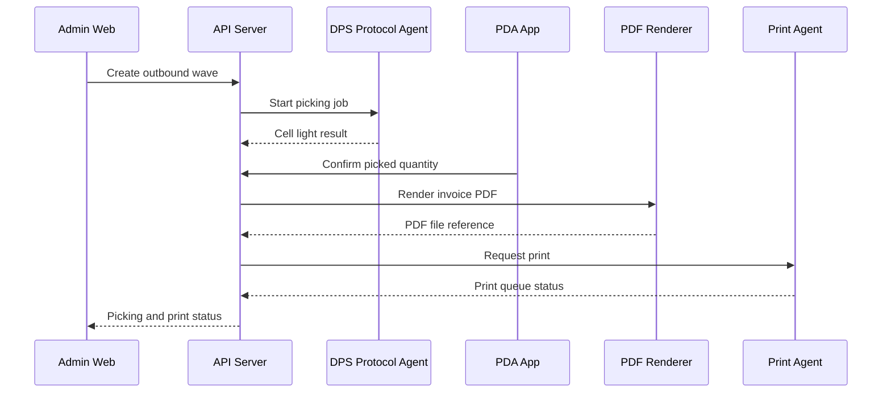

# Domain Flow

## First Slice: Outbound Picking And Printing

## State Examples

- Picking: `READY -> ASSIGNED -> PICKING -> COMPLETED -> CANCELED`
- Print job: `REQUESTED -> QUEUED -> PRINTING -> PRINTED -> FAILED`
- DPS cell: `IDLE -> LIGHT_ON -> CONFIRMED -> LIGHT_OFF -> ERROR`

