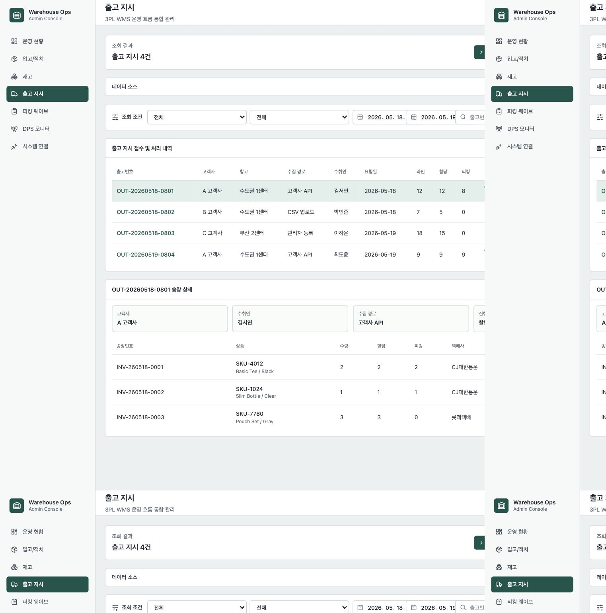
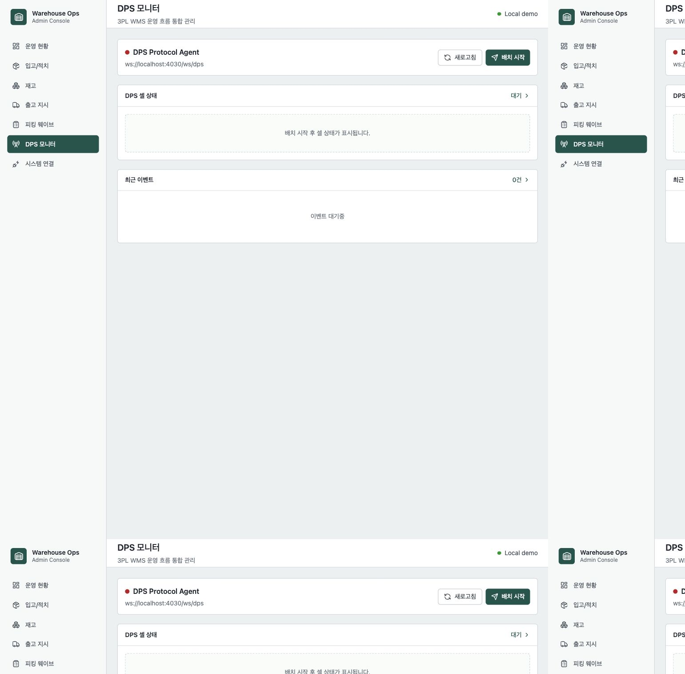

# Warehouse Ops Suite 제품 매뉴얼 및 기능 명세

## 1. 문서 목적

이 문서는 Warehouse Ops Suite의 Admin Web 화면을 기준으로 운영자가 어떤 업무를 수행할 수 있는지 설명하는 사용자 매뉴얼이자, 각 화면이 어떤 데이터와 API 흐름으로 구성되는지 정리한 기능 명세서입니다.

대상 독자는 다음과 같습니다.

- 물류 운영자: 메뉴별 사용 방법과 조회 기준 확인
- 개발자/포트폴리오 검토자: 기능 범위, 화면 설계, 도메인 모델, API 연동 흐름 확인
- 포트폴리오 검토자: 프로젝트가 단순 UI가 아니라 실제 WMS 업무 흐름을 고려했는지 확인

## 2. 사용자 역할

| 역할 | 주요 관심사 | 사용하는 메뉴 |
| --- | --- | --- |
| 운영 관리자 | 당일 입고/출고/피킹 현황, 이슈 큐, 고객사별 처리율 | 운영 현황, 출고 지시, 피킹 웨이브 |
| 입고 담당자 | 입고 지시, 검수 수량, 적치 진행률 | 입고/적치, PDA App |
| 재고 담당자 | 고객사별 재고, 로케이션 적재율, 보류 재고 | 재고 |
| 출고 담당자 | 출고 지시, 재고 할당, 송장/상품별 진행 상태 | 출고 지시 |
| 현장 피킹 담당자 | 피킹 웨이브, DPS 작업, 피킹리스트 출력 | 피킹 웨이브, DPS 모니터 |
| 시스템 운영자 | API/PDF/Agent 연결 상태, 배포 단위 확인 | 시스템 연결 |

## 3. 메뉴 구조

| 메뉴 | 목적 | 핵심 기능 |
| --- | --- | --- |
| 운영 현황 | 물류센터 당일 운영 요약 | KPI, 이슈 큐, 고객사별 처리율, 최근 입출고 |
| 입고/적치 | 입고 지시와 PDA 기반 검수/적치 진행 관리 | 입고 조회, 검수/적치 수량, 상세 라인 |
| 재고 | 고객사/창고/로케이션/SKU별 재고 관리 | 재고 조회, 적재율 맵, 보류/할당 수량 |
| 출고 지시 | 외부 시스템에서 받은 출고 지시 관리 | 출고 조회, 상세 송장/상품 상태 |
| 피킹 웨이브 | 출고 지시 라인을 피킹 작업 단위로 묶고 실행 | 웨이브 생성, DPS 전송, 피킹리스트 출력 |
| DPS 모니터 | DPS 장비 상태와 셀 작업 상태 확인 | WebSocket 연결, 셀 점등, 완료/실패 이벤트 |
| 시스템 연결 | 중앙 서비스와 로컬 에이전트 실행 단위 확인 | 서비스/에이전트 endpoint, 상태, 역할 |

## 4. 운영 현황

### 화면 목적

운영 현황은 WMS 운영자가 가장 먼저 보는 화면입니다. 입고, 재고, 출고, 피킹을 개별 메뉴로 들어가기 전에 현재 병목과 이슈를 빠르게 파악하도록 설계했습니다.

### 주요 구성

| 영역 | 설명 |
| --- | --- |
| 상단 KPI | 입고 진행, 가용 재고, 출고 지시, 피킹 작업 수량 요약 |
| 운영 이슈 큐 | 검수 대기, 출고 할당 확인, DPS 웨이브 대기, 할당 재고 등 운영 확인 대상 |
| 고객사별 처리 현황 | 고객사별 처리율 또는 SLA 성격의 진행률 표시 |
| 최근 입고 내역 | 고객사, 창고, 요청자 기준 최근 입고 상태 표시 |
| 최근 출고 내역 | 고객사, 수취인, 유입 채널, 출고 상태 표시 |
| 재고 알림 | 할당, 보류, 부족 등 운영자가 확인해야 할 재고 상태 |

### 사용자 동작

1. 운영자는 상단 KPI로 전체 물량을 확인한다.
2. 운영 이슈 큐에서 병목 항목을 확인한다.
3. 최근 입고/출고 내역에서 특정 업무 흐름으로 이동할 대상을 파악한다.
4. 고객사별 처리율이 낮은 고객사를 우선 확인한다.

### 기능 명세

| 항목 | 내용 |
| --- | --- |
| API | `GET /api/dashboard` |
| 주요 데이터 | `metrics`, `issueQueue`, `clientSla`, `recentReceiving`, `recentOutbound`, `inventoryAlerts` |
| 상태 처리 | API 성공 시 실데이터 표시, 실패 시 데모 데이터 fallback |
| 설계 의도 | 운영자가 메뉴를 이동하기 전 당일 우선순위를 잡을 수 있게 한다 |

## 5. 입고/적치

### 화면 목적

입고/적치 화면은 입고 지시가 PDA 검수와 로케이션 적치로 이어지는 과정을 관리자 관점에서 모니터링하는 화면입니다.

### 주요 구성

| 영역 | 설명 |
| --- | --- |
| 조회 조건 | 고객사, 창고, 상태, 기간, 키워드 기준 조회 |
| 입고 KPI | 입고 예정, 검수 완료, 적치 완료, 미적치 수량 |
| 입고 목록 | 입고번호, 고객사, 창고, 요청자, 예정/검수/적치 수량, 상태 |
| 입고 상세 | SKU별 예정 수량, 검수 수량, 적치 수량, 파손/부족 수량 |

### 사용자 동작

1. 고객사와 창고를 선택해 입고 지시를 조회한다.
2. 상태값으로 `입고예정`, `검수중`, `적치중`, `적치완료` 대상을 필터링한다.
3. 특정 입고 지시를 선택해 SKU별 검수/적치 진행률을 확인한다.
4. 미적치 수량이 큰 입고 지시를 현장 PDA 작업 대상으로 판단한다.

### 기능 명세

| 항목 | 내용 |
| --- | --- |
| API | `GET /api/receiving-orders` |
| 주요 데이터 | 입고 헤더, 고객사, 창고, 상태, SKU별 예정/검수/적치 수량 |
| 연동 흐름 | PDA 검수 API, 적치 작업 API와 연결되는 모니터링 화면 |
| 상태값 | `REQUESTED`, `RECEIVING`, `PUTAWAY`, `COMPLETED`, `CANCELED` |
| 설계 의도 | 입하 수량과 실제 검수/적치 수량을 분리해 물류센터의 부분 입고/분할 적치를 표현한다 |

## 6. 재고/로케이션

### 화면 목적

재고 화면은 3PL 환경에서 고객사별 재고 소유권과 로케이션별 적재 상태를 함께 관리하기 위한 화면입니다.

### 주요 구성

| 영역 | 설명 |
| --- | --- |
| 조회 조건 | 고객사, 창고, 재고 상태, 키워드 |
| 재고 KPI | 가용 수량, 할당 수량, 보류 수량 |
| 재고 목록 | 고객사, SKU, 로케이션, 가용/할당/보류 수량 |
| 로케이션 맵 | 로케이션별 적재율, 구역, 상태 |
| 로케이션 상세 | 선택 로케이션의 적재 수량과 SKU 목록 |

### 사용자 동작

1. 고객사별 재고를 조회한다.
2. 보류 수량이나 할당 수량이 높은 SKU를 확인한다.
3. 로케이션 맵에서 적재율이 높은 구역을 확인한다.
4. 특정 로케이션을 선택해 어떤 SKU가 들어있는지 확인한다.

### 기능 명세

| 항목 | 내용 |
| --- | --- |
| API | `GET /api/inventories` |
| 주요 데이터 | 고객사, 창고, 로케이션, SKU, 가용/할당/보류 수량 |
| 상태 처리 | 정상, 할당, 보류, 부족 등 운영 상태 표시 |
| 설계 의도 | WMS 재고를 단순 수량이 아니라 로케이션 단위의 현장 상태로 볼 수 있게 한다 |

## 7. 출고 지시

### 화면 목적

출고 지시는 OMS, 쇼핑몰, ERP, 수기 입력 등 외부에서 전달된 출고 요청을 WMS가 받아 재고 할당과 피킹으로 연결하는 화면입니다.

### 주요 구성

| 영역 | 설명 |
| --- | --- |
| 조회 조건 | 고객사, 상태, 출고 요청일, 키워드 |
| 출고 목록 | 출고번호, 고객사, 수취인, 유입 방식, 요청일, 수량 상태 |
| 송장 상세 | 출고 지시 하위 송장/상품/할당/피킹/출력 상태 |

### 사용자 동작

1. 고객사 또는 출고 상태로 출고 지시를 조회한다.
2. 특정 출고 지시를 선택한다.
3. 하위 송장과 상품별 수량 상태를 확인한다.
4. 재고 부족 또는 미할당 상태를 운영 이슈로 분류한다.

### 기능 명세

| 항목 | 내용 |
| --- | --- |
| API | `GET /api/outbound-orders`, `GET /api/outbound-orders/{orderId}` |
| 주요 데이터 | 출고 헤더, 출고 라인, 주문 수량, 할당 수량, 피킹 수량 |
| 유입 방식 | `API`, `CSV_UPLOAD`, `EDI_FILE`, `MANUAL` |
| 상태값 | `RECEIVED`, `ALLOCATED`, `WAVE_ASSIGNED`, `PICKING`, `PACKING`, `READY_TO_SHIP`, `SHIPPED`, `CANCELED` |
| 설계 의도 | WMS는 주문 수집 전체가 아니라 출고 지시 접수 이후의 재고/피킹 운영을 책임지는 구조로 표현한다 |

## 8. 피킹 웨이브

### 화면 목적

피킹 웨이브는 할당된 출고 지시 라인을 현장 작업 단위로 묶고, DPS 전송 또는 PDA 피킹으로 연결하는 화면입니다.

### 주요 구성

| 영역 | 설명 |
| --- | --- |
| 웨이브 생성 후보 | 피킹 작업으로 묶을 수 있는 할당 완료 라인 |
| 웨이브 목록 | 웨이브 번호, 고객사, 창고, 작업 존, 주문/작업/완료 수량 |
| DPS 작업 전송 | 선택 웨이브를 DPS Protocol Agent로 전송 |
| 피킹리스트 출력 | Print Agent 출력 큐에 피킹리스트 작업 등록 |
| 포함 송장 | 웨이브 하위 송장/상품/로케이션/작업자/상태 |
| 출력 작업 | 피킹리스트 출력 요청 결과와 실패 사유 |

### 사용자 동작

1. 웨이브 생성 후보에서 같은 고객사/창고의 라인을 선택한다.
2. `선택 라인으로 생성`을 눌러 피킹 웨이브를 생성한다.
3. DPS 작업이 필요한 웨이브를 선택한다.
4. `DPS 전송`으로 셀 점등 작업을 시작한다.
5. `피킹리스트 출력`으로 현장 작업용 문서를 출력 큐에 등록한다.
6. 하위 송장 테이블에서 피킹 진행률과 작업자 상태를 확인한다.

### 기능 명세

| 항목 | 내용 |
| --- | --- |
| API | `GET /api/outbound-waves`, `POST /api/outbound-waves`, `POST /api/outbound-waves/{waveId}/dispatch-dps` |
| 출력 API | `POST /api/outbound-waves/{waveId}/print-jobs/picking-list`, `GET /api/outbound-waves/{waveId}/print-jobs` |
| 주요 데이터 | 웨이브, PickingTask, OutboundOrderLine, PrintJob |
| 상태값 | `READY`, `ALLOCATED`, `PICKING`, `COMPLETED`, `CANCELED` |
| 예외 처리 | 고객사/창고가 다른 라인 선택 방지, 피킹 가능 수량 없는 라인 방지, DPS/Print Agent 실패 메시지 표시 |
| 설계 의도 | 출고 지시를 현장 작업 단위로 재구성하고, 장비/출력 같은 현장 의존 기능을 운영 UI에서 제어한다 |

## 9. DPS 모니터

### 화면 목적

DPS 모니터는 실제 DPS 하드웨어 없이도 피킹 배치와 셀 점등 상태를 확인할 수 있는 장비 프로토콜 시뮬레이터 화면입니다.

### 주요 구성

| 영역 | 설명 |
| --- | --- |
| 연결 상태 | WebSocket 연결 여부 |
| 배치 시작 | 데모 피킹 배치 전송 |
| 셀 상태 | 셀 코드, SKU, 수량, 점등/완료/실패 상태 |
| 이벤트 로그 | DPS Agent에서 발생한 최근 이벤트 |

### 사용자 동작

1. DPS Agent 연결 상태를 확인한다.
2. 피킹 웨이브 화면에서 DPS 전송을 실행한다.
3. 모니터 화면에서 셀 점등 상태를 확인한다.
4. 특정 셀의 피킹 완료 이벤트를 확인한다.

### 기능 명세

| 항목 | 내용 |
| --- | --- |
| WebSocket | `ws://localhost:4030/ws/dps` |
| 상태 API | `GET /simulator/state` |
| 완료 API | `POST /simulator/cells/{cellCode}/confirm` |
| 주요 메시지 | `PICKING_BATCH_STARTED`, `PICKING_BATCH_ACCEPTED`, `DPS_CELL_PICKED`, `DPS_AGENT_ERROR` |
| 설계 의도 | 실제 장비 없이도 장비 프로토콜과 운영 UI 반응을 검증할 수 있게 한다 |

## 10. 시스템 연결

### 화면 목적

시스템 연결 화면은 Warehouse Ops Suite가 단일 애플리케이션이 아니라 여러 실행 단위가 연결된 운영 시스템임을 보여주는 화면입니다.

### 주요 구성

| 영역 | 설명 |
| --- | --- |
| 중앙 서비스 | API Server, PDF Renderer |
| 로컬/현장 에이전트 | DPS Protocol Agent, Print Agent, PDA Sync Client |
| Endpoint | 서비스별 HTTP/WebSocket endpoint |
| 상태 | 설계 완료, 연결 가능, MVP 등 현재 구현 단계 |

### 기능 명세

| 항목 | 내용 |
| --- | --- |
| 목적 | 컴포넌트별 실행 위치와 역할 설명 |
| 배포 관점 | 중앙 서비스와 현장 에이전트의 배포 주기 분리 |
| 설계 의도 | 모노레포 안에서도 실제 운영 배포 단위가 다르다는 점을 드러낸다 |

## 11. 주요 상태값

### 입고 상태

| 상태 | 의미 |
| --- | --- |
| `REQUESTED` | 입고 지시 생성, 검수 전 |
| `RECEIVING` | PDA 검수 진행 중 |
| `PUTAWAY` | 적치 작업 진행 중 |
| `COMPLETED` | 검수/적치 완료 |
| `CANCELED` | 입고 취소 |

### 출고 상태

| 상태 | 의미 |
| --- | --- |
| `RECEIVED` | 출고 지시 접수 |
| `ALLOCATED` | 재고 할당 완료 |
| `WAVE_ASSIGNED` | 피킹 웨이브 배정 |
| `PICKING` | 피킹 진행 중 |
| `PACKING` | 패킹 진행 중 |
| `READY_TO_SHIP` | 출고 대기 |
| `SHIPPED` | 출고 완료 |
| `CANCELED` | 출고 취소 |

### 피킹/출력 상태

| 구분 | 상태 | 의미 |
| --- | --- | --- |
| 피킹 | `READY` | 작업 대기 |
| 피킹 | `ASSIGNED` | 작업자 또는 장비 배정 |
| 피킹 | `PICKING` | 피킹 진행 |
| 피킹 | `COMPLETED` | 피킹 완료 |
| 출력 | `REQUESTED` | 출력 요청 생성 |
| 출력 | `QUEUED` | Print Agent 큐 등록 |
| 출력 | `FAILED` | 출력 실패 |

## 12. 예외/실패 처리

| 상황 | 처리 |
| --- | --- |
| API Server 연결 실패 | Admin Web은 데모 데이터 fallback으로 화면 유지 |
| 출고 지시 중복 | 고객사 + 출고번호 기준 중복 방지 |
| SKU 고객사 불일치 | 출고/입고 생성 시 고객사 소유 SKU 검증 |
| 재고 부족 | 할당 로직에서 부족 수량 예외 처리 |
| 웨이브 생성 후보 오류 | 고객사/창고가 다른 라인 선택 방지 |
| DPS Agent 미응답 | timeout 후 운영자용 실패 메시지 반환 |
| Print Agent 실패 | 출력 작업 `FAILED`와 실패 사유 저장 |

## 13. API 연동 요약

| 화면 | API |
| --- | --- |
| 운영 현황 | `GET /api/dashboard` |
| 입고 지시 | `GET /api/receiving-orders`, `POST /api/receiving-orders` |
| 입고 검수/적치 | `POST /api/receiving-orders/lines/{lineId}/receive`, `POST /api/putaway-tasks`, `POST /api/putaway-tasks/{taskId}/complete` |
| 재고 | `GET /api/inventories` |
| 출고 지시 | `GET /api/outbound-orders`, `POST /api/outbound-orders`, `GET /api/outbound-orders/{orderId}`, `POST /api/outbound-orders/{orderId}/allocate` |
| 피킹 웨이브 | `GET /api/outbound-waves`, `POST /api/outbound-waves`, `GET /api/outbound-waves/{waveId}`, `GET /api/outbound-waves/candidates` |
| 피킹 확정 | `POST /api/picking-tasks/{taskId}/confirm` |
| DPS 전송 | `POST /api/outbound-waves/{waveId}/dispatch-dps` |
| 피킹리스트 출력 | `POST /api/outbound-waves/{waveId}/print-jobs/picking-list` |
| 출력 상태 | `GET /api/outbound-waves/{waveId}/print-jobs` |

## 14. 포트폴리오 설명 포인트

- 화면은 운영자 업무 절차를 기준으로 구성했다.
- 조회 조건은 모든 메뉴에 같은 형태로 복붙하지 않고, 각 화면의 목적에 맞게 조정했다.
- 출고 지시와 피킹 웨이브는 헤더/라인/송장 상세를 분리해 운영 추적성을 높였다.
- DPS와 Print Agent는 실제 현장 장비/로컬 PC 의존성을 표현하기 위해 별도 실행 단위로 분리했다.
- 포트폴리오 범위에서는 실제 하드웨어 대신 mock/simulator를 사용했지만, 인터페이스는 실제 연동을 염두에 둔 구조로 설계했다.
